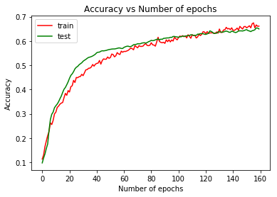

# Project Description
This is my first attempt at dealing with 3D data. The method used was a simple 3D convolution that downsampled the voxelgrid to a lower dimension space with a consequent fully connected sub-network. It really is a simple architecture but the technology has multiple real-world use cases, one prominent example is 3D Medical Imaging.

## Dataset Used
[3D MNIST](https://www.kaggle.com/daavoo/3d-mnist). The description of the data and helper code can be found on Kaggle itself, where the data was originally hosted. I have currently only used the ```full_dataset_vectors.h5``` file and not the point clouds. The vectors were used to create a voxelgrid of dimensions (16,16,16,3).

## Files
- `main.ipynb` - Training script  
- `model.py` - Model architecture for the 3D-CNN.
- `utils.py` - Helper functions

## Model Architecture
The following text was created using [torchsummary](https://pypi.org/project/torchsummary/).
```
----------------------------------------------------------------
        Layer (type)               Output Shape         Param #
================================================================
            Conv3d-1      [2000, 8, 14, 14, 14]             656
            Conv3d-2     [2000, 32, 12, 12, 12]           6,944
         MaxPool3d-3        [2000, 32, 3, 3, 3]               0
            Conv3d-4        [2000, 32, 1, 1, 1]          27,680
       BatchNorm3d-5        [2000, 32, 1, 1, 1]              64
           Dropout-6                 [2000, 32]               0
            Linear-7                 [2000, 10]             330
================================================================
Total params: 35,674
Trainable params: 35,674
Non-trainable params: 0
----------------------------------------------------------------
```
The pre-trained model can be found [here](https://drive.google.com/file/d/1dejUwoN_97eK4k7TXo6OnKH6QrOg4Jpx/view?usp=sharing)

## Results
- **Training and Testing losses**

<br>
- **Training and Testing Accuracies**



As observed in the plots above, the model has converged with an accuracy of **67%** on the training data and **65%** on the test data. The training was carried out for **160 epochs** with a learning rate of **0.00005** using an Adam Optimizer.

The testing accuracy can be increased by about **(1.5-2.0)%** upto **~67%** but only at the cost of the model overfitting the training data. I analysed the results for 300 epochs with the same hyperparameters and the training accuracy increased upto **73%** but there was a clear divergence observed between the training and testing loss at the latter end of the training.

## To-Do
- [ ] Try using a point cloud based approach.<br>
I am not actively working on this, it was more like a side project so I don't really know when I'll get to do this.  
